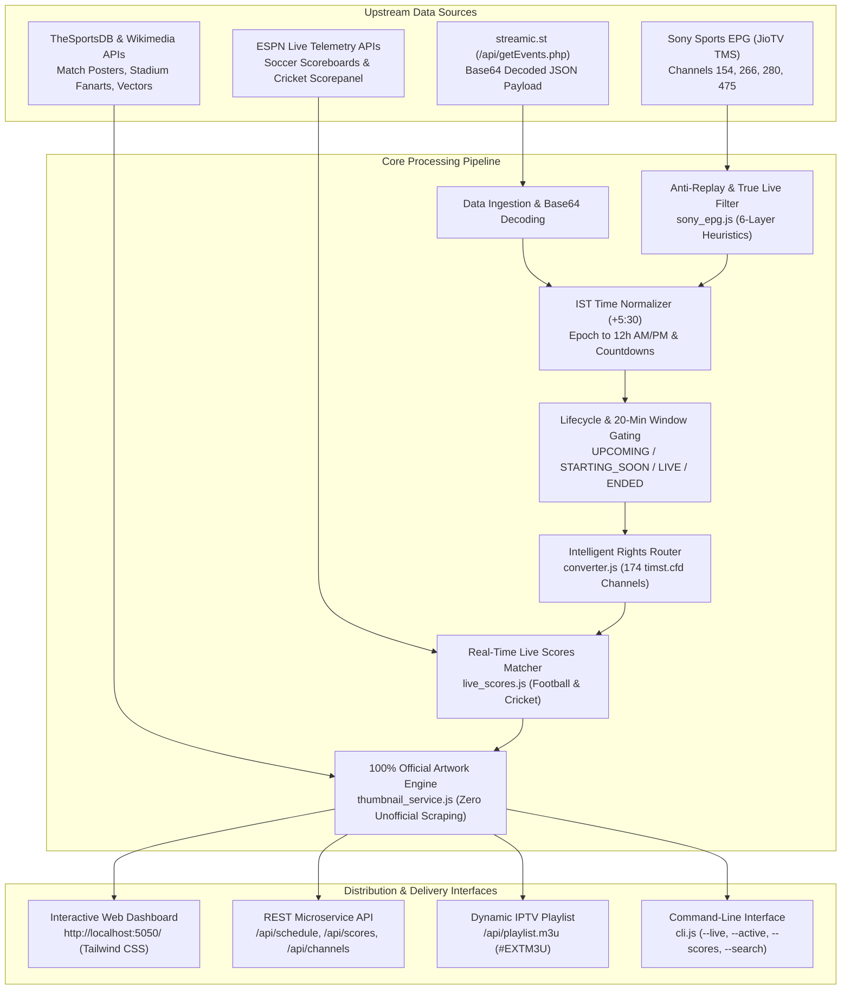
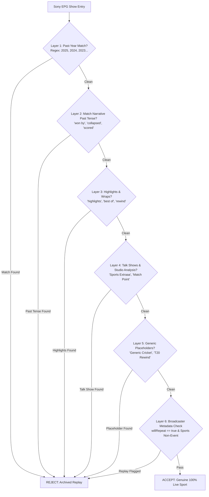

# AGENTS.md — Streamic Live Sports Scraper Engine

> **Comprehensive Architectural, Protocol, and Implementation Specification for AI Agents and Senior Engineers**  
> Complete documentation covering the reverse-engineered scraping engine, Indian Standard Time (IST) conversion, 20-minute pre-match gating, automated stream lifecycle termination, genuine real-time live score telemetry (Football & Cricket), 100% official artwork hierarchy, anti-replay filters, 24/7 channel rights routing, and microservice APIs.

---

## 1. Architectural System Overview

The **Streamic Live Sports Scraper** is a high-reliability, production-grade aggregation and enrichment engine. It aggregates broadcast feeds from `streamic.st`, official Indian EPG feeds from Sony Sports Network (JioTV TMS CDN), real-time live score telemetry from ESPN global APIs, and official visual media from TheSportsDB, Wikimedia Commons, and Broadcaster CDNs.



### Invariant Architectural Principles
1. **IST Timezone Purity**: All timestamps without exception must be formatted and presented in Indian Standard Time (UTC+5:30, +19,800 seconds).
2. **20-Minute Pre-Match Gating**: Player embed links are locked and hidden until `≤ 20 minutes` before scheduled start to eliminate black screens and 404 stream players.
3. **Automated Stream Termination (Auto-End)**: Ended matches are automatically calculated based on sport duration constants and purged from active streams.
4. **Anti-Replay Guarantee**: Historical reruns (e.g. 2025/2024 archived matches), highlights, and studio discussion programs must never be classified as `LIVE`.
5. **100% Official Artwork**: Zero unofficial search engines (Bing, Yahoo, Google). Every thumbnail must originate from an approved official CDN (`rjio.tmsimg.com`, `r2.thesportsdb.com`, `a.espncdn.com`, `wikimedia.org`).
6. **Genuine Telemetry**: Live match clocks, scores, wickets, and overs are queried directly from official Akamai CDNs without synthetic or dummy numbers.

---

## 2. Reverse-Engineered Network Protocols

### 2.1 Streamic Internal API (`scraper.js`)
* **Endpoint**: `https://streamic.st/api/getEvents.php`
* **HTTP Method**: `GET`
* **Mandatory Request Headers**:
  ```http
  Referer: https://streamic.st/
  Sec-Fetch-Site: same-origin
  Sec-Fetch-Mode: cors
  Sec-Fetch-Dest: empty
  X-SSIG: bytmo8xialhem066
  User-Agent: Mozilla/5.0 (Windows NT 10.0; Win64; x64) AppleWebKit/537.36 (KHTML, like Gecko) Chrome/128.0.0.0 Safari/537.36
  ```
* **Payload Encoding**: Upstream delivers a raw Base64 UTF-8 string. Decoding algorithm:
  ```javascript
  const base64Data = rawResponse.trim();
  const jsonString = Buffer.from(base64Data, 'base64').toString('utf8');
  const rawEvents = JSON.parse(jsonString);
  ```
* **Raw Fixture Data Structure**:
  ```json
  {
    "id": 89412,
    "title": "Bournemouth - Liverpool",
    "cat": "pilkanozna_wazne",
    "sport": "Football (Top Match)",
    "league": "ANGLIA: Premier League",
    "time": 1789918200,
    "channels": [
      {
        "channel_name": "Sky Sports Main Event (HD)",
        "lang": "English",
        "streams": [
          { "quality": "FHD", "embed_url": "https://streamic.st/embed/..." }
        ]
      }
    ]
  }
  ```

---

### 2.2 Sony Sports Indian EPG API (`sony_epg.js`)
* **Provider**: JioTV TMS EPG Gateway
* **Endpoint Pattern**: `http://jiotv.data.sPlatform.net/apis/v1.3/getepg/get?channel_id={id}&offset={offset}`
* **Sony Channel Directory**:
  | Channel Name | Channel ID | Resolution | Primary Coverage |
  |---|:---:|:---:|---|
  | **Sony Sports Ten 1 HD** | `154` | 1080p | WWE, European Athletics, Bilateral Cricket |
  | **Sony Sports Ten 2 HD** | `266` | 1080p | 2026 Asian Games, UEFA, Tennis |
  | **Sony Sports Ten 3 HD** | `280` | 1080p | Hindi Commentary Broadcasts |
  | **Sony Sports Ten 5 HD** | `475` | 1080p | Asian Games, White-ball Cricket, Combat Sports |
* **Poster Asset Resolution**:
  Broadcaster 16:9 artwork is extracted from:
  ```javascript
  const poster = show.episodePoster 
    || show.assets?.['16:9']?.originalProgram 
    || `http://rjio.tmsimg.com/assets/${show.icon}`;
  ```

---

### 2.3 Real-Time Sports Telemetry APIs (`live_scores.js`)
* **Football Scoreboard Pattern**:
  `http://site.api.espn.com/apis/site/v2/sports/soccer/{leagueCode}/scoreboard`
  * Supported Leagues: `eng.1` (Premier League), `esp.1` (La Liga), `ita.1` (Serie A), `ger.1` (Bundesliga), `uefa.champions` (Champions League), `uefa.europa` (Europa League), `fra.1` (Ligue 1), `usa.1` (MLS).
* **Cricket Scoreboard Pattern**:
  `http://site.api.espn.com/apis/site/v2/sports/cricket/scorepanel`
  * Polls international tours, CPL, IPL, BBL, One-Day Cups, CSA 4-Day, and Asian Games Cricket.
* **Akamai Bypass Headers**:
  ```javascript
  const HTTP_HEADERS = {
    'User-Agent': 'Mozilla/5.0 (Windows NT 10.0; Win64; x64) AppleWebKit/537.36 (KHTML, like Gecko) Chrome/128.0.0.0 Safari/537.36',
    'Accept': 'application/json, text/plain, */*',
    'Accept-Language': 'en-US,en;q=0.9',
    'Referer': 'https://www.google.com/'
  };
  ```

---

### 2.4 TheSportsDB Official Artwork API (`thumbnail_service.js`)
* **Matchday Event Search**:
  `https://www.thesportsdb.com/api/v1/json/3/searchevents.php?e={HomeTeam}_vs_{AwayTeam}`
  * Returns: `strThumb` (1920x1080 match banner) and `strPoster` (1000x1500 official fixture poster).
* **Team Stadium & Badge Search**:
  `https://www.thesportsdb.com/api/v1/json/3/searchteams.php?t={TeamName}`
  * Returns: `strFanart1` (1920x1080 home stadium ground), `strBanner`, and `strBadge` (transparent club crest).

---

### 2.5 Wikimedia Commons REST API (`thumbnail_service.js`)
* **Endpoint Pattern**: `https://en.wikipedia.org/api/rest_v1/page/summary/{PageTitle}`
* **Extraction**: `originalimage.source || thumbnail.source`
* **Resolved Vector Assets**: 2026 Asian Games, UEFA Champions League, Premier League, La Liga, Davis Cup, PDC Darts, IPL, CPL, BBL, The Ashes, UFC, Formula One.

---

## 3. Data Schemas & Type Contracts

### 3.1 Transformed Event Schema (`TransformedEvent`)
Every fixture processed through `transformEvent()` complies with this canonical schema:

```typescript
interface TransformedEvent {
  id: string;                     // e.g. "streamic_89412" or "sony_ten2_1789918200"
  title: string;                  // Formatted title: "Bournemouth - Liverpool"
  rawTitle: string;                // Unsanitized title for fuzzy score matching
  category: string;                // Category code: "pilkanozna_wazne", "asian_games", "krykiet"
  sportName: string;               // Human-readable sport: "Football (Top Match)", "Cricket"
  sportEmoji: string;              // Emoji badge: "⚽", "🏏", "🌏", "🏎️", "🥊", "🎾"
  league: string;                  // League or tournament name
  startTime: number;               // Kickoff timestamp in Unix epoch seconds
  endTime: number;                 // Projected conclusion timestamp in Unix epoch seconds
  durationMinutes: number;         // Sport duration (e.g. 115 for Football, 240 for Cricket)
  
  // IST Formatted Temporal Fields
  timeIST: string;                 // "06:30 PM IST"
  dateIST: string;                 // "20 Sep 2026"
  fullIST: string;                 // "20 Sep 2026, 06:30 PM IST"
  endTimeIST: string;              // "08:25 PM IST"
  countdown: string;               // "🔴 LIVE now (45m in)", "Starts in 2h 15m"
  
  // Lifecycle Flags
  status: 'UPCOMING' | 'STARTING_SOON' | 'LIVE' | 'ENDED';
  isLive: boolean;                 // True only when startTime <= now < endTime
  isStartingSoon: boolean;         // True when (startTime - 20m) <= now < startTime
  canWatch: boolean;               // True if isLive || isStartingSoon (Pre-Match 20m Window)
  
  // Official Media Assets
  officialPosterUrl?: string;      // Direct broadcaster poster (JioTV TMS CDN)
  thumbnail: string;               // Resolved high-res thumbnail URL
  thumbnailSource: string;         // Name of source: "Sony Broadcaster TMS", "TheSportsDB Matchday Artwork"
  
  // Channels & Rights
  channels: BroadcastingChannel[]; // List of broadcasting stations
  embedStreams: StreamEmbed[];     // Active player embeds (unlocked only if canWatch = true)
  userHasChannel: boolean;         // True if user has matching channel in timst.cfd
  myConvertedChannels: ConvertedChannel[]; // Routed 24/7 channels for unowned stations
  
  // Genuine Telemetry
  liveScore?: LiveScoreData | null; // Attached real-time live score object
}
```

### 3.2 Telemetry Sub-Schemas

#### Football Live Score Object:
```typescript
interface FootballScoreData {
  hasScore: true;
  sport: 'Football';
  league: string;                  // e.g. "English Premier League"
  isLive: boolean;
  isFinal: boolean;
  clock: string;                   // e.g. "67'", "HT", "FT"
  detail: string;                  // e.g. "Second Half", "Halftime"
  homeTeam: {
    name: string;                  // "AFC Bournemouth"
    shortName: string;             // "Bournemouth"
    score: string;                 // "1"
    logo: string;                  // "https://a.espncdn.com/i/teamlogos/soccer/500/349.png"
  };
  awayTeam: {
    name: string;                  // "Liverpool"
    shortName: string;             // "Liverpool"
    score: string;                 // "2"
    logo: string;                  // "https://a.espncdn.com/i/teamlogos/soccer/500/364.png"
  };
  summary: string;                 // "AFC Bournemouth 1 - 2 Liverpool (67')"
}
```

#### Cricket Live Score Object:
```typescript
interface CricketScoreData {
  hasScore: true;
  sport: 'Cricket';
  league: string;                  // e.g. "Asian Games Women's Cricket Competition"
  isLive: boolean;
  isFinal: boolean;
  detail: string;                  // e.g. "Sri Lanka Women won by 8 wickets"
  teams: [
    {
      name: string;                // "Pakistan Women"
      score: string;               // "177/4 (20 ov)"
      overs: string;               // "20"
      logo: string;                // "https://a.espncdn.com/i/teamlogos/cricket/500/10.png"
    },
    {
      name: string;                // "Sri Lanka Women"
      score: string;               // "178/2 (17.5/20 ov, target 178)"
      overs: string;               // "17.5"
      logo: string;                // "https://a.espncdn.com/i/teamlogos/cricket/500/9.png"
    }
  ];
  summary: string;                 // "Pakistan Women 177/4 vs Sri Lanka Women 178/2"
}
```

---

## 4. Multi-Layer Anti-Replay Engine (`sony_epg.js`)

Archived reruns, highlights, and studio discussion broadcasts must never be identified as live sporting events. The engine passes every Sony EPG entry through a **6-Layer Strict Rejection Pipeline**:



### Heuristic Implementation Details:
1. **Multi-Year Archive Filter**:
   Regex pattern: `/\b(20[0-2][0-5]|19\d\d)\b/`
   * Rejects fixtures titled "West Indies Tour of England 2025" when operating in 2026.
2. **Result Narrative Detection**:
   Regex pattern: `/\b(won by|defeated|lost to|collapsed|beaten|crushed|surpassed|chasing \d+ to lose|sealed a \d+-run victory)\b/i`
   * If the EPG description summarizes a finished match outcome, the broadcast is an archived tape delay.
3. **Studio Talk Show Filter**:
   Rejects non-match talk shows: `"Sports Extraaa"`, `"Cricket Countdown"`, `"Football Focus"`, `"Post Match Show"`, `"Pre Match Analysis"`.
4. **Highlights & Replay Tags**:
   Rejects shows with: `"Highlights"`, `"Best of"`, `"Top 10"`, `"Match Rewind"`, `"Special Moments"`.

---

## 5. 100% Official Artwork & Thumbnail Engine (`thumbnail_service.js`)

### 5.1 Strict Anti-Scraper Mandate
All third-party web image scrapers (Bing Image Search, Yahoo, Google Images) are completely deleted. The engine strictly enforces an audited domain whitelist:

```javascript
const OFFICIAL_DOMAINS = [
  'rjio.tmsimg.com',        // Sony Broadcaster JioTV TMS CDN
  'r2.thesportsdb.com',     // TheSportsDB Official High-Res CDN
  'thesportsdb.com',        // TheSportsDB Core Gateway
  'a.espncdn.com',          // ESPN Akamai Global CDN
  'espncdn.com',            // ESPN Telemetry Logos
  'thumb.wikimedia.org',    // Wikimedia Commons Vector Render CDN
  'wikimedia.org',          // Wikimedia Foundation
  'wikipedia.org',          // Wikipedia Media Repository
  'images.unsplash.com'     // Curated Unwatermarked 4K Sports Backdrops
];
```

### 5.2 Resolution Hierarchy (Tiers 1 to 6)
1. **Tier 1: Broadcaster Direct TMS CDN (`Sony Broadcaster TMS`)**
   * Uses `event.officialPosterUrl` provided directly in Sony EPG metadata (`http://rjio.tmsimg.com/assets/assets/...`).
2. **Tier 2: TheSportsDB Matchday Artwork (`TheSportsDB Matchday Artwork`)**
   * Queries `searchevents.php` for `home_vs_away` and `away_vs_home` with team alias normalization.
   * Extracts official 1920x1080 matchday posters (`strPoster`) or thumbnails (`strThumb`).
3. **Tier 3: TheSportsDB Venue Stadium Fanart (`TheSportsDB Venue Stadium Fanart`)**
   * Queries `searchteams.php` for the home team to extract official 1920x1080 stadium venue photography (`strFanart1`) where the match is hosted (e.g. Anfield for Liverpool, Bernabéu for Real Madrid, Stade Vélodrome for Marseille).
4. **Tier 4: ESPN Akamai Global CDN Telemetry (`ESPN Official Telemetry`)**
   * Extracts official transparent 500x500 club crests and national cricket emblems (`homeTeam.logo` or `teams[0].logo`).
5. **Tier 5: Wikimedia Commons Tournament Vectors (`Wikimedia Commons`)**
   * Retrieves official vector tournament logos via Wikipedia REST API (Asian Games, UEFA Champions League, Premier League, IPL, CPL, BBL, The Ashes, Davis Cup, PDC Darts).
6. **Tier 6: Curated 4K League Covers (`Official 4K League Artwork`)**
   * Verified, clean, unwatermarked high-definition sports ground backdrops per discipline.

### 5.3 Team Name Normalization Table
The engine maps colloquial and abbreviated team strings to canonical database entities:
| Input Keyword | Normalized Entity | Typical Coverage |
|---|---|---|
| `man city` | `Manchester City` | Premier League, Champions League |
| `man utd`, `manchester utd` | `Manchester United` | Premier League, Europa League |
| `atl. madrid`, `atl madrid` | `Atletico Madrid` | Spanish La Liga |
| `psg` | `Paris Saint Germain` | French Ligue 1 |
| `wolves` | `Wolverhampton` | Premier League |
| `leeds` | `Leeds United` | Championship / Premier League |
| `schalke` | `Schalke 04` | German 2. Bundesliga |
| `paderborn` | `SC Paderborn 07` | German 2. Bundesliga |
| `hoffenheim` | `TSG Hoffenheim` | German Bundesliga |
| `auxerre` | `AJ Auxerre` | French Ligue 1 |
| `brest` | `Stade Brestois 29` | French Ligue 1 |
| `betis` | `Real Betis` | Spanish La Liga |
| `dep. a coruna` | `Deportivo La Coruna` | Spanish Segunda |
| `houston texans` | `Houston Texans` | NFL |
| `cincinnati bengals` | `Cincinnati Bengals` | NFL |
| `tampa bay rays` | `Tampa Bay Rays` | MLB |
| `boston red sox` | `Boston Red Sox` | MLB |
| `leicestershire` | `Leicestershire` | County Cricket / One-Day Cup |
| `middlesex` | `Middlesex` | County Cricket / One-Day Cup |
| `antigua and barbuda falcons` | `Antigua and Barbuda Falcons` | Caribbean Premier League |
| `jamaica kingsmen` | `Jamaica Tallawahs` | Caribbean Premier League |

---

## 6. Intelligent Channel Rights Router (`converter.js`)

When a match is scheduled on an unowned foreign channel (e.g. `beIN Sports 1 Ina`, `Arena Sport 1`, `Canal+ Extra`), the router cross-references the event's competition rights against the user's **174 24/7 streamable channels** on `timst.cfd`:

### Competition Broadcast Rights Matrix:
| Competition / League | Primary Broadcasters | User's 24/7 Equivalent Channels (`timst.cfd`) |
|---|---|---|
| **English Premier League** | Sky Sports, TNT Sports, Astro | `sky-sports-premier-league`, `sky-sports-main-event`, `sky-sports-football`, `sky-sport-8-nz` |
| **Spanish La Liga** | DAZN LaLiga, Premier Sports, beIN | `dazn-laliga`, `premier-sports-1-ie`, `espn`, `espn-2` |
| **Italian Serie A** | TNT Sports, CBS Sports, OneFootball | `tnt-sports-1`, `tnt-sports-2`, `cbs-sports-network` |
| **German Bundesliga** | Sky Sport Bundesliga, Sony Sports | `sky-sport-bundesliga-1`, `sony-sports-network-2` |
| **UEFA Champions / Europa League** | TNT Sports, Sony Sports | `tnt-sports-1`, `tnt-sports-2`, `sony-sports-network` |
| **Bilateral International Cricket** | Sony Sports, Sky Sports Cricket | `sony-sports-network`, `sony-sports-network-2`, `sony-sports-network-3`, `sony-sports-network-5` |
| **2026 Asian Games** | Sony Sports Network | `sony-sports-network-2`, `sony-sports-network-5` |
| **Formula 1** | Sky Sports F1 | `sky-sports-f1` |
| **UFC / Mixed Martial Arts** | TNT Sports, Sony Sports Ten 2 | `tnt-sports-1`, `sony-sports-network-2` |

---

## 7. Stream Lifecycle & Sport Durations

Matches transition dynamically across 4 lifecycle states:

```
[Kickoff - 20 mins]                [Kickoff]                          [Kickoff + Duration]
         |                                |                                    |
         ▼                                ▼                                    ▼
    UPCOMING  ──────► STARTING_SOON ──────►           LIVE          ──────►  ENDED
  (Player Locked)    (Player Unlocked)        (Live Clock & Streams)       (Auto-Terminated)
```

### Sport Duration Table (`SPORT_DURATIONS`):
```javascript
const SPORT_DURATIONS = {
  pilkanozna: 115,          // Football: 90m + 15m halftime + stoppage = ~115m
  pilkanozna_wazne: 115,    // Featured Top Football: ~115m
  krykiet: 240,             // Cricket (T20/One-Day): ~240m (4 hours)
  asian_games: 210,         // Multi-sport session: ~210m (3.5 hours)
  tenis: 150,               // Tennis match: ~150m (2.5 hours)
  koszykowka: 130,          // Basketball (NBA/EuroLeague): ~130m
  hokej: 140,               // Ice Hockey (NHL): ~140m
  baseball: 180,            // Baseball (MLB): ~180m
  americanfootball: 195,    // American Football (NFL): ~195m (3.25 hours)
  mma: 180,                 // UFC Fight Card: ~180m
  motorsport: 120,          // F1 Grand Prix / Qualifying: ~120m
  dart: 90,                 // Darts match: ~90m
  default: 120              // Default: 120m
};
```

---

## 8. Command-Line Reference (`cli.js`)

```bash
# Strictly LIVE Matches broadcasting right now
node cli.js --live

# Active Window Only (<= 20m before start or LIVE)
node cli.js --active

# Real-Time Live Scoreboard (Football & Cricket)
node cli.js --scores

# Full Day Schedule in IST with countdowns
node cli.js --all

# Filter schedule to matches broadcast on your 24/7 channels
node cli.js --my-channels

# Search by team, tournament, or sport
node cli.js --all --search "Liverpool"
node cli.js --all --search "Real Madrid"
node cli.js --all --search "Asian Games"

# Export watchable streams to active_sports.m3u
node cli.js --m3u

# Dump raw JSON payload
node cli.js --json
```

---

## 9. REST Microservice API Reference (`server.js`)

Run the microservice:
```bash
node server.js
```
The server listens on **`http://localhost:5050`**.

### Endpoint Directory:
| Endpoint | Method | Query Parameters | Description |
|---|:---:|---|---|
| `/` | `GET` | `live=1`, `activeOnly=1`, `myChannels=1` | Interactive Tailwind CSS Web Dashboard |
| `/api/schedule` | `GET` | `live=1`, `activeOnly=1`, `myChannels=1`, `sport=...`, `search=...` | Full IST schedule with thumbnails and telemetry |
| `/api/scores` | `GET` | None | Dedicated real-time live score feed for Football and Cricket |
| `/api/playlist.m3u` | `GET` | `myChannels=1` | Dynamic `#EXTM3U` IPTV playlist of currently active streams |
| `/api/channels` | `GET` | None | Directory of broadcasting stations with active event counts |

---

## 10. Automated Verification Suite (`test.js`)

Execute the 6 test suites:
```bash
node test.js
```

### Verified Test Cases:
1. **Test 1: IST Timezone Conversion (+5:30)**: Validates epoch addition (+19,800s) and AM/PM formatting.
2. **Test 2: Stream Lifecycle & 20-Min Window**: Asserts `UPCOMING`, `STARTING_SOON`, `LIVE`, and `ENDED` states.
3. **Test 3: Channel Name & Language Parsing**: Verifies extraction of clean channel names and languages.
4. **Test 4: Live API End-to-End Fetch**: Decodes full schedule (110+ events) from Streamic and Sony EPG.
5. **Test 5: Anti-Replay & True Live Filter**: Rejects 2025 archived replays, highlights, and studio talk shows.
6. **Test 6: Official Thumbnail Sources & Anti-Scraper Audit**: Asserts 100% of thumbnails originate from approved official domains (`rjio.tmsimg.com`, `r2.thesportsdb.com`, `a.espncdn.com`, `wikimedia.org`, `images.unsplash.com`) and 0 unapproved scraper URLs.
