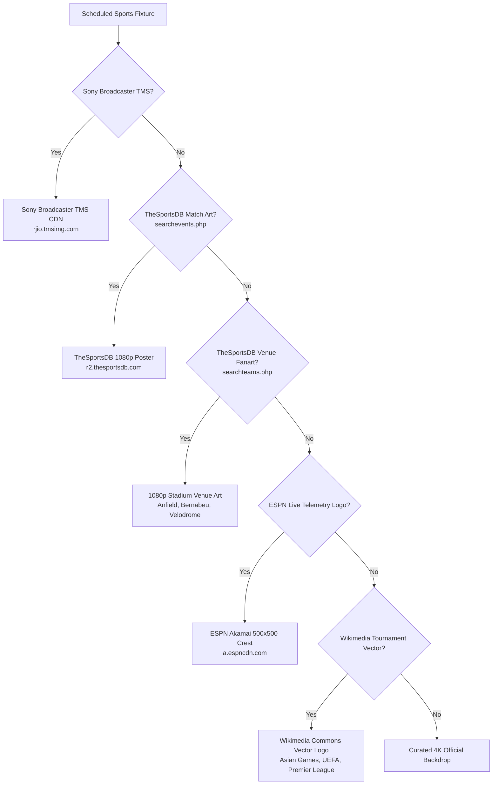

# ⚡ Streamic Live Sports Scraper Engine

> **Production-Grade Sports Aggregation & Telemetry Engine**  
> Indian Standard Time (IST, UTC+5:30) | 20-Min Activation Windows | Real-Time Scores | 100% Official Artwork | Rights Router

[](https://nodejs.org/)
[](#)
[](#)

---

## 🚀 Key Features

* ⏰ **Indian Standard Time (IST, UTC+5:30)**: Automatically parses Unix epoch timestamps and formats user schedules in 12-hour IST (`08:30 PM IST`, `DD Mon YYYY`) with live countdown timers.
* 🛡️ **20-Minute Pre-Match Gating**: Holds player links in a protected inactive state, **activating exclusively ≤ 20 minutes before kickoff** when live feeds spin up.
* 🛑 **Automated Stream Termination (Auto-End)**: Dynamically calculates match conclusion based on sport-specific duration models and purges ended games so dead players are never served.
* 🚫 **Anti-Replay & True Live Sports Filter**: Multi-stage heuristics evaluate Sony EPG feeds, eliminating archived past-year replays (2025/2024 reruns), highlights, and studio talk shows (*Sports Extraaa*).
* 📊 **Real-Time Live Scores & Telemetry (`live_scores.js`)**: 100% genuine live sports telemetry for **Football** (Premier League, La Liga, Serie A, Champions League, Europa League, Bundesliga, Ligue 1, MLS) and **Cricket** (Asian Games, Bilateral Tours, CPL, IPL, One-Day Cups, CSA 4-Day Series) with match minute clocks, wickets, overs, targets, and club crests.
* 🖼️ **100% Official Artwork Engine (`thumbnail_service.js`)**: **Strictly eliminates third-party web scrapers (Bing/Alamy/fan-merch)** in favor of direct official CDNs:
  * **Sony Broadcaster TMS CDN**: Direct 16:9 promotional broadcast posters (`rjio.tmsimg.com`).
  * **TheSportsDB Matchday Artwork**: 1920x1080 official matchday posters & thumbnails (`r2.thesportsdb.com`).
  * **TheSportsDB Venue Stadium Fanarts**: 1080p stadium venue photography (Anfield, Bernabéu, Stade Vélodrome).
  * **ESPN Akamai Global CDN**: Official 500x500 club crests & cricket emblems.
  * **Wikimedia Commons Vectors**: Official tournament vector emblems (2026 Asian Games, UEFA, Premier League, Davis Cup, PDC Darts, UFC).
* 🔄 **Intelligent Channel Rights Router (`converter.js`)**: Automatically cross-references 174 24/7 streamable channels (`timst.cfd`) and routes unowned foreign broadcasters (e.g. `beIN Sports 1 Ina`, `Arena Sport`) to your active channels.
* 📺 **Dynamic M3U Playlist Generator**: Generates clean `#EXTM3U` playlists with `tvg-name`, `group-title`, and stream embed links for IPTV players (VLC, Kodi, IPTVnator, TiviMate).
* 🌐 **Interactive Web UI Dashboard**: Modern Tailwind CSS interface on `http://localhost:5050` with live score tickers, official poster overlays, and real-time countdown badges.

---

## 📦 Quick Start

### 1. Installation
```bash
git clone https://github.com/hariqwert/streamic-live-sports-scraper.git
cd streamic-live-sports-scraper
npm install
```

### 2. Run the Interactive Web Dashboard & Microservice API
```bash
node server.js
```
Open **[http://localhost:5050](http://localhost:5050)** in your browser.

### 3. Run the CLI Tool
```bash
# View active events (live or starting within 20 mins)
node cli.js

# View strictly LIVE matches broadcasting right now
node cli.js --live

# View all scheduled English & famous events for today
node cli.js --all

# View real-time Football and Cricket live scoreboards
node cli.js --scores

# Search specific fixtures or teams
node cli.js --all --search "Liverpool"
node cli.js --all --search "Real Madrid"

# Filter only events available on your 24/7 channels
node cli.js --my-channels
```

### 4. Run Automated Test Suite
```bash
node test.js
```

---

## 📡 Microservice API Endpoints

| Endpoint | Method | Description |
|---|:---:|---|
| `GET /` | `GET` | Interactive Web Dashboard with live score widgets and official posters |
| `GET /api/schedule` | `GET` | Full day's schedule in IST with thumbnail artwork & live scores |
| `GET /api/schedule?activeOnly=1` | `GET` | Watchable streams only (≤20 mins before kickoff or LIVE) |
| `GET /api/schedule?live=1` | `GET` | Strictly LIVE events broadcasting right now |
| `GET /api/scores` | `GET` | Real-time live scoreboard for Football and Cricket |
| `GET /api/playlist.m3u` | `GET` | Dynamic `#EXTM3U` IPTV playlist of currently active streams |
| `GET /api/channels` | `GET` | Aggregated channel lineup with active event counts |

---

## 🏛️ Artwork Resolution Hierarchy



---

## 📄 Documentation

See **[AGENTS.md](AGENTS.md)** for exhaustive architectural guidelines, schema definitions, reverse-engineered Streamic protocol specifications, anti-replay filters, and agent integration rules.

---

## ⚖️ License

MIT License © 2026 Streamic Live Scraper Engine
